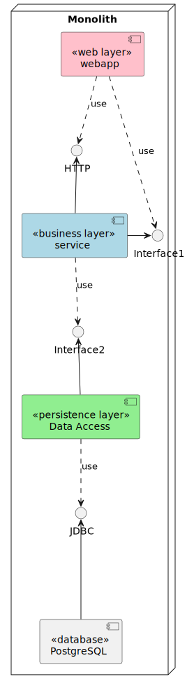

# Architecture

<!--
@startuml Monolithic

skinparam component {
    BackgroundColor<<web layer>> Pink
    BackgroundColor<<<business layer>> LightBlue
    BackgroundColor<<<persistence layer>> LightGreen
}

node "Monolith" {

    [webapp] <<web layer>>
    [webapp] ..> HTTP: use
    [webapp] ..> Interface1: use

    [service] <<business layer>>
    [service] -up-> HTTP
    [service] -right-> Interface1
    [service] ..> Interface2: use

    [Data Access] <<persistence layer>>
    [Data Access] -up-> Interface2
    [Data Access] ..> JDBC: use

    [PostgreSQL] <<database>>
    [PostgreSQL] --up-> JDBC
}
@enduml
-->

